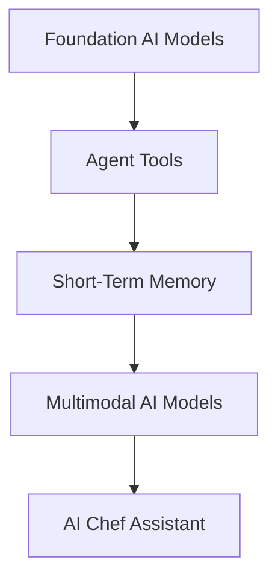

# Stage 1 — Agent Foundations

Welcome to the first stage of this AI Agents learning journey.

In this stage, I focused on understanding the core building blocks behind modern AI agents using **LangChain** and **LangGraph** before moving on to larger applications.

---

## 📚 Notebooks

### 1. Foundation AI Models

Learn the fundamentals of modern AI models, how they work, and how they are used within AI applications.

---

### 2. Agent Tools

Understand how AI agents extend their capabilities by interacting with external tools.

Topics covered:

- Tool Calling
- Custom Tools
- Web Search
- Agent Reasoning

---

### 3. Short-Term Memory

Learn why LLMs are stateless and how LangGraph enables conversation memory using checkpointers.

Topics covered:

- Stateless LLMs
- InMemorySaver
- Thread IDs
- Conversation State

---

### 4. Multimodal AI Models

Explore how modern AI models understand multiple input modalities.

Topics covered:

- Text Inputs
- Image Understanding
- Audio Inputs
- Base64 Encoding
- Multimodal Messages

---

## 🚀 Capstone Project

### AI Chef Assistant

A real-world AI application combining everything learned in this stage.

Features:

- AI Agent
- Tool Calling
- Web Search
- Short-Term Memory
- Multimodal Image Understanding
- Personalized Recipe Generation

---

## 🛠 Technologies

- Python
- LangChain
- LangGraph
- OpenAI
- Tavily Search
- Jupyter Notebook

---

## 🎯 Learning Outcomes

After completing this stage, you should understand:

- How AI Agents work.
- How Tools extend LLM capabilities.
- Why LLMs are stateless.
- How Short-Term Memory works.
- How Multimodal AI processes different types of inputs.
- How to combine all these concepts into a complete AI application.

